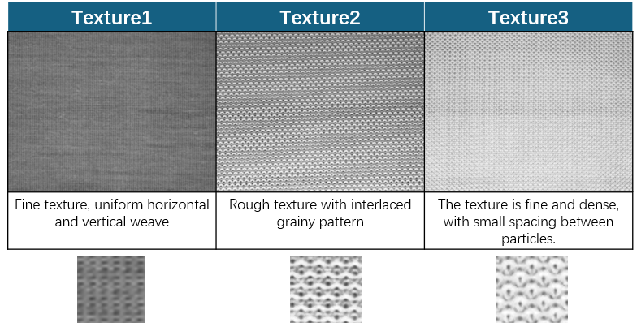

# Time-Series Circula Knitting Dataset, 
First Edition of the Circula Knitting Dataset
— Intelligent Systems Software Laboratory, National Central University, Taiwan

## Introduction to the First Edition of the Circula Knitting Dataset
The first edition of the Periodic Knitted Fabric Dataset has been compiled and open-sourced by the Intelligent Software Systems Laboratory at National Central University, Taiwan. It includes three types of knitted fabrics. The dataset consists of 10,000 training images and 500 test images, with image resolutions of 800x640 and 400x320.

## Dataset Characteristics
### Cutline Characteristics
To facilitate precise cutting after production, circular knitting machines incorporate two missing needles at fixed positions to form cutlines. These cutlines are an intentional part of the design, serving as guidelines for fabric cutting rather than defects. However, these cutlines closely resemble common defects, such as vertical line defects (V-line). Therefore, distinguishing cutlines from actual defects is a critical challenge in real-time defect detection.

defect-free sample image

### Illumination Characteristics
Since the camera lacks a color sensor, the captured images are strongly affected by lighting conditions. As the camera can only capture grayscale information, the same fabric may appear in different shades under varying lighting conditions. Hence, accurately distinguishing between normal and defective images across different lighting levels is another key challenge in real-time defect detection.

### Periodicity Characteristics
The periodicity of images in different datasets may vary. Periodicity refers to the number of images between the occurrences of two consecutive cutlines. In the Periodic Knitted Fabric Dataset, this value ranges from 60 to 300.

For example, in dataset 243_1_00 (periodicity = 60):

### Defect Characteristics
The dataset includes a wide range of defect types, including common defects such as linear defects, point defects, and medium-sized holes. Additionally, it contains rare large-scale defects and defects that appear alongside cutlines in the same image.

Defect sample image

## Dataset Structure
The dataset includes three different knitted fabric textures, labeled as Texture 1, Texture 2, and Texture 3. These textures are further divided based on lighting conditions, resulting in six datasets:

## Training and Testing Data Splits
Each dataset's training set consists of 30 randomly selected images, including:

+ 15 defect-free fabric images
+ 15 fabric images with cutlines

The test images are collected sequentially to reflect the dynamic nature of real-world industrial processes. The table below provides a detailed breakdown of the training and testing dataset splits:

| Dataset  | lighting Condition  |Texture Type| Training Set (Normal/Cutline)| Testing Set (Normal/Cutline/Defect) |
|----------|---------------------|------------|--------------------|------------------------|
| Dataset1 | Uniform Lighting    | Texture 1  | 15 / 15             | 5000 / 172 / 49         |
| Dataset2 | Uniform Lighting    | Texture 2  | 15 / 15             | 1742 / 64 / 21          |
| Dataset3 | Uniform Lighting    | Texture 3  | 15 / 15             | 4290 / 148 / 42         |
| Dataset4 | Non-Uniform Lighting| Texture 1  | 15 / 15             | 1755 / 67 / 145         |
| Dataset5 | Non-Uniform Lighting| Texture 2  | 15 / 15             | 1580 / 59 / 16          |
| Dataset6 | Non-Uniform Lighting| Texture 3  | 15 / 15             | 1100 / 40 / 34          |

## File Structure
The Circular Knitted Fabric Dataset (CKD-1) folder contains three fabric types: Texture 1, Texture 2, and Texture 3. These are placed in three separate directories, each named accordingly. The overall structure is as follows:

Each knitted fabric dataset includes two subdirectories: train (training set) and test (test set). The training set contains defect-free images and periodic cutline images, stored in the defect-free folder. Corresponding ground truth defect masks are stored in the groundtruth folder. The test set includes periodic cutline images (circular folder) and ground truth annotations. The test set consists of defect-free images, periodic cutline images, and defective samples (defect folder).

For example, the file structure of Texture 1 is shown below:

## Download

To be announced.
